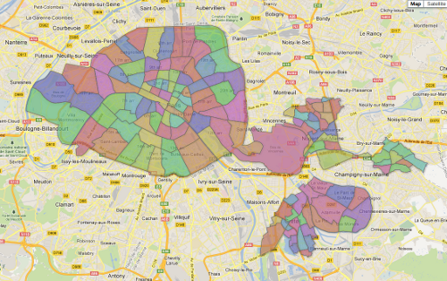

Visualize Multiple MapIt Areas
==============================

It is sometimes useful to be able to see all areas of a particular
type rendered onto a map, for example to check that the coverage of a
region is complete.  MapIt doesn't provide this functionality itself,
but there is a Django admin command you can use to generate a file
that can be visualized in [Google Fusion
Tables](http://www.google.com/drive/start/apps.html#fusiontables).

Here are a couple of example invocations of the script.

e.g. 1: in MapIt Global, find all countries:

    ./manage.py mapit_make_fusion_csv --type=O02 --tolerance=0.001 global-countries.csv

e.g. 2: in MapIt Global, find all `admin_level="10"` areas in France:

    ./manage.py mapit_make_fusion_csv --types=O10 --coveredby=28 france-10.csv

(That assumes that 28 is the ID of the area corresponding to
[http://www.openstreetmap.org/browse/relation/1403916](France) in your
MapIt.)

To import such CSV files into Google Fusion Tables, and make them
look good, do the following:

1. Go to
   [http://www.google.com/drive/start/apps.html#fusiontables](Google Fusion Tables)
   and click "Create a new table"

2. Select the CSV file you generated, with the defaults ("comma" as
   the separator and UTF-8 encoding).  Then click "Next".

3. In the next dialog, the default ("Column names are in row 1")
   should be fine, so just click "Next"

4. Put the correct attribution in the "Attribute data to" and the
   "Attribution page link" fields (e.g. "OpenStreetMap contributors
   and MapIt Global" and
   "http://global.mapit.mysociety.org/").
   Then click "Finish".

5. Now click on the "Map of name" tab.  Select "location" from the
   `Tools -> Select location` submenu.

6. Go to `Tools -> Change map style ...`, select `Polygons -> Fill
   color`, the Column tab, and specify the "color" column for colours.

7. You might need to switch to the "Rows 1" tab and back to the "Map
   of name" tab for the areas to be visible.

8. Go to `File -> Share` and change "Private" to "Anyone with the link"
